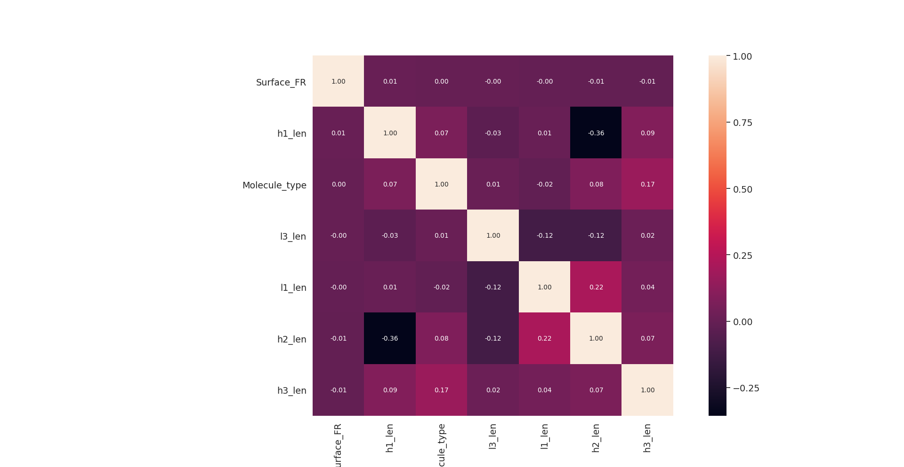
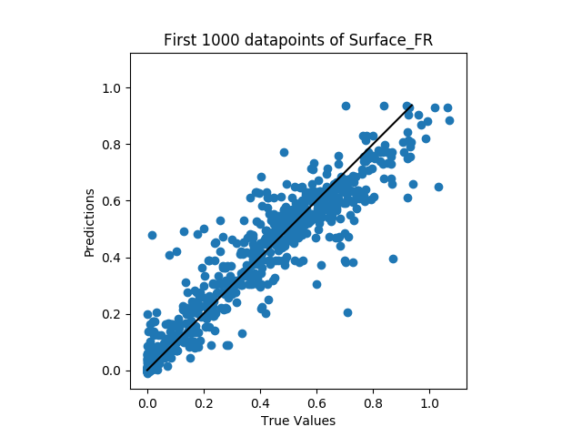
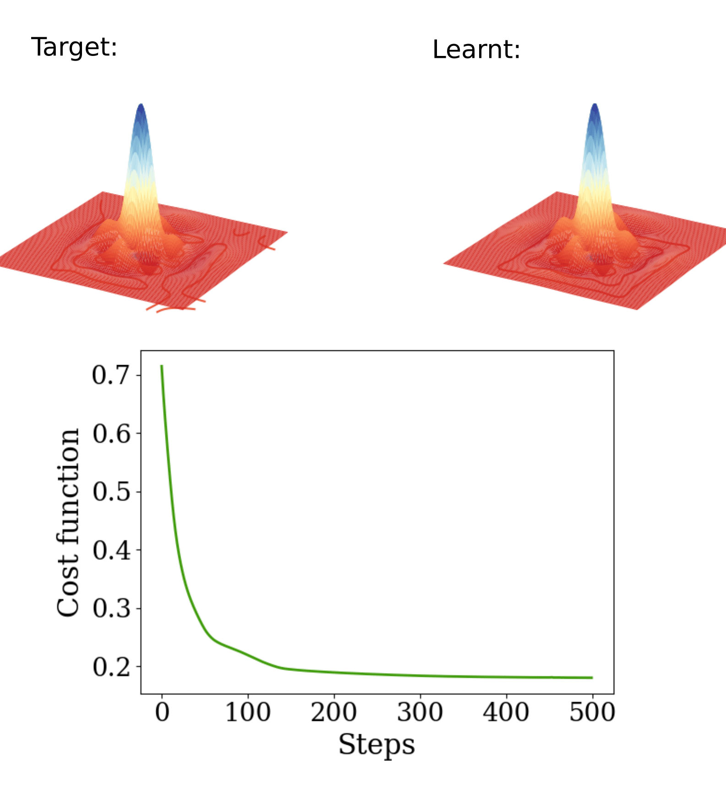

# Python Examples
Examples of personal and pofessional projects in Python 

# Machine Learning Example:
This project uses data (~100,000 rows) of engineered molecules to predict properties which are difficult to measure in practise. However, there are molecule properties which are easy to measure and can act as predictors of the more difficult to access properties. 

Key libraries used here include are numpy, pandas, sklearn, keras, matplotlib and seaborn.

Please find model and data visualisations in the accompanying slides at: https://docs.google.com/presentation/d/1iiCG0XYOAxON6B8cKhYWHjurm69qLtmoDEYENoU40II/edit?usp=sharing

The bulk of this project can be found in the model.py file: https://github.com/anthayes92/Python-Examples/blob/master/Machine%20Learning/model.py

The broad steps include data preprocessing e.g analysing correlations:
 
  

Creating and tuning a neural network:

  

Analysing and testing the model predictive perfomance:

# Data Analysis Example:
This collaborative project (consisting of 3 physics PhDs with a shared passion for bouldering) used data scraped from the popular climbing website:
https://www.8a.nu/

Here we see part of this analysis in which the BMI of climbers around Europe is compared to that of the general population using publicly available EU 2014 census data. This focuses on the European countries for which there is the most data available on climbers (via "8a" users). 

The results are divided between males and females: 

Note that a significant proportion of female rock climbers are underweight compared to the general population!

The full analysis is available here: 
https://github.com/anthayes92/Python-Showcase/blob/master/Data%20Analysis%20Example/Full_Analysis.pdf

# Quantum state learning (in StrawberryFields)
[Macine Specs: Dell Latitude-E5540, Intel® Core™ i5-4310U CPU @ 2.00GHz × 4. OS: Ubuntu 16.04.5 LTS 64-bit]

This project uses software developed by Xanadu called StrawberryFields:
https://strawberryfields.readthedocs.io/en/latest/ and builds on the machine learning method for state preparation introduced in: 
https://arxiv.org/abs/1807.10781

In the present work I use machine learning optimisation algorithms, provided by the TensorFlow backend of StrawberryFields, to engineer continuous variable states of particular interest to quantum metrology. The Python script for these states is available here:
https://github.com/anthayes92/Python-Showcase/blob/master/SF%20quantum%20state%20learning%20/learner/cv_states.py

The state of interest is the so called "squeezed entangled state" which has been shown to exhibit high precision gains for applications such as gravitational wave detection but is difficult to engineer in practise:
https://journals.aps.org/pra/abstract/10.1103/PhysRevA.93.033859

This was tried with a few different optimisation algorithms, the Adam optimiser was found to give the best fidelities ~0.7. The results of this are given here: https://github.com/anthayes92/Python-Showcase/tree/master/SF%20quantum%20state%20learning%20/sim_results/SES_z%3D2_d20_c10_r500

where the upper two plots are quasi-probability distributions of the target and learnt quantum states. 

Future work (ideally on better suited hardware!) would include optimisation of hyperparameters to increase fidelities (>0.9), state engineering of other non-Guassian states of interest to quantum metrology such as the "squeezed cat state" and engineering of multimode (more than 2 mode) states.

# Example of published research in Quantum Metrology
In this project we see an example of Python code used to produce results for the published paper:
https://iopscience.iop.org/article/10.1088/2058-9565/aac30b

The main interest of this code is the simulated evolution of quantum mechaical states: 
https://github.com/anthayes92/Python-Showcase/blob/master/Quantum%20Metrology/state_evolution.py

and the numerical optimisations of these processes which generate the data to be analysed:
https://github.com/anthayes92/Python-Showcase/blob/master/Quantum%20Metrology/optimisations---data_generation.py

